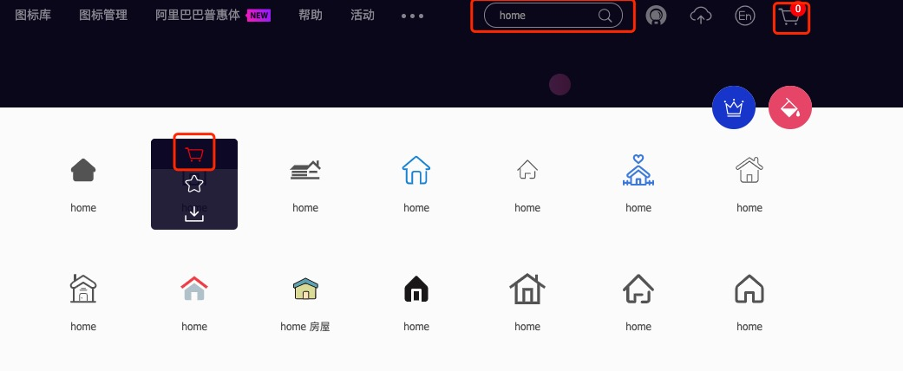
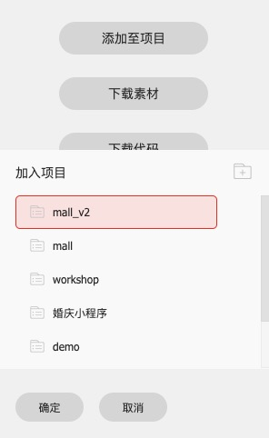
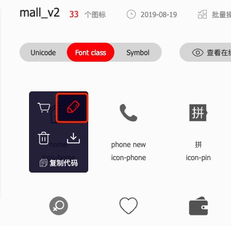
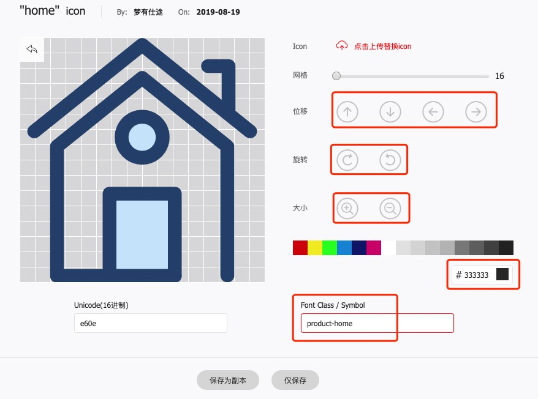
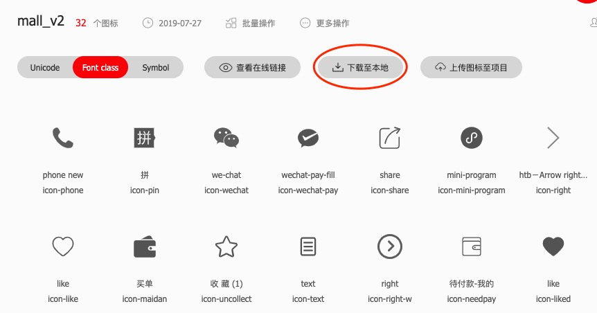

### 概述
在小程序中，经常使用的小图标如果都是用图片形式的话，会大大增加小程序的体积，为了缩小体积，我们可以使用[阿里巴巴矢量图表库](https://www.iconfont.cn)
### 准备

在图表库的搜索栏中搜索你想要的图标字体，并加入购物车  
  
在购物车中，将选中的图标加入项目，如果没有，则新建项目  
  
别急着下载图标字体，你可以自己定义自己的图标字体class，这样能使你为你的项目挑选的图标字体更加语义化  
  
你可以微调你心仪的图标字体包括class名字，颜色，大小，位置等等。
  
下载到本地
  
将下载下来的内容解压，并将`iconfonts.css`文件内容复制到小程序新建文件夹中，将后缀名改为`wxss`，并将下面标注部分删除。
```css
/* 修改下载的iconfont.css改名为iconfont.wxss 并在app.wxss中引入 */
/* style/iconfont.wxss */
@font-face {
    font-family: 'iconfont';  /* project id 1280838 */
    src: 
    /**
    这部分删除
    url('iconfont.eot?t=1564817270348');
    src: url('iconfont.eot?t=1564817270348#iefix'') format('embedded-opentype'),**/
    url('data:application/x-font-woff2;charset=utf-8;base64,/** base64代码 **/') /**
    这部分删除
    format('woff2'),
    url('//at.alicdn.com/t/font_1280838_td5qd4v3f4q.woff') format('woff'),
    url('//at.alicdn.com/t/font_1280838_td5qr4v3f4q.ttf') format('truetype'),
    url('//at.alicdn.com/t/font_1280838_td5q4vb3f4q.svg#iconfont') format('svg')**/;
  }

  .iconfont {
    font-family: "iconfont" !important;
    font-size: 16px;
    font-style: normal;
    -webkit-font-smoothing: antialiased;
    -moz-osx-font-smoothing: grayscale;
  }
  
  .icon-apps:before {
    content: "\e729";
  }
  
  .icon-right:before {
    content: "\e696";
  }
  
  .icon-time:before {
    content: "\e614";
  }
  
  .icon-text:before {
    content: "\e808";
  }
  
  .icon-wechat-pay-fill:before {
    content: "\e773";
  }
```
从style文件中引入字体文件
```css
/* app.wxss */
@import './styles/iconfonts.wxss';
```

### 使用
在需要使用的page或者`component`中使用
```html
<icon class="iconfont icon-right" />
```

### 特殊情况
在使用`icon`的过程中，发现一个问题，就是如果你在`component`中使用`icon`时无法生效，解决办法就是在组件的wxss中`@import`字体文件，之后就能使用了。

### 更新
随着项目的开发，会不断的添加和删除和更新图标字体，那么这份图标字体文件`iconfont.wxss`将会不断的迭代更新，只要重复上面的操作，将download下的`iconfont.css`文件删除`@font-face`的部分内容即可使用，别忘了修改文件后缀名，否则小程序将不能`import`字体样式文件。